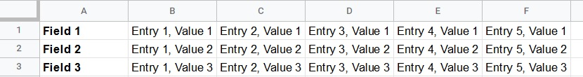

## Transpose Sheet

This Google Sheets script reads horizontal column input from an 'Input' sheet and transposes them into vertical row output for an 'Output' sheet. In other words, it changes the spreadsheet orientation from horizontal to vertical.

---

### Background

I wrote the original version of the script as part of a training exercise when I started working for Response. It was to give my boss an idea of my abilities as a programmer, and to give me an opportunity to familiarise myself with the Google Sheets scripting environment.

### Example

\
\
**Before**
\

\
\
**After**
\

---

### Getting Started
To install this script, refer to these [instructions](../install.md#sheet).

### Transpose Settings

| Program Setting | Type | Description | Example |
|---|---|---|---|
| clearExistingOutput | Boolean | If this is true, the output sheet will be cleared of any existing data before transposing. | true |
| clearCompletedInput | Boolean | If this is true, input data will be cleared upon successful transpose. | true |

These only apply for the 'Transpose' action. The 'Clear' and 'Format' actions do not have any settings of their own.

---

[Return to Home Page](../readme.md)